# H4 Ultra + H3+ Production Plan

> Implementation status (2026-08-28): the H3 application plane, H4 KaosBrain,
> guarded KaosAI chat, and the office Fax Connector/Bridge are active. This
> document remains the architecture and rollback contract; phase instructions
> that describe those components as future work are retained for rebuilds.

## 1. Objective

Build the next Kaos platform around two new permanent roles:

- **H4 Ultra, 32 GB**: KaosBrain, optional KaosAI/OpenClaw planner runtime,
  and local model inference.
- **H3+, 32 GB**: KaosGovernor, authoritative personal/family backends,
  Personal and Family KaosGDD PWAs, and the public/private application edge.

Discord retains only the private `#brain` conversational surface. The personal
KaosGDD PWA at `kaosgdd.net` is the primary visual console; Shortcuts provides
Action Button, Siri, Share Sheet, quick-action, and deep-link integration.
Native Calendar and Reminders continue syncing Radicale and may retain native
notifications without being the preferred UI. Pushover provides minimal
immediate text alerts. The family continues to use `family.kaosgdd.net`,
including an embedded family-scoped AI chat.

Office Kaos remains a separate clinic-critical system. PACS, DICOM, fax
hardware, Paperless, RustDesk, and other hardware- or clinic-bound services are
not coupled to availability of the H4 or H3+.

This is an incremental migration. No phase wipes a host, moves PACS/DICOM, or
requires every service to cut over at once.

## 2. Architecture

```mermaid
flowchart TD
    Discord["Discord: private #brain only"] --> BrainBot["KaosBrain Discord integration"]
    IOS["iOS Calendar + Reminders"] -->|"CalDAV: events, tasks, supplies"| Radicale
    IOSActions["Shortcuts + optional Scriptable"] --> Governor
    Governor --> Push["Pushover: minimal text alerts"]
    PersonalWeb["kaosgdd.net personal PWA"] --> Governor
    FamilyWeb["family.kaosgdd.net"] --> FamilyGateway["Family chat gateway"]

    subgraph H4["H4 Ultra 32 GB: AI plane"]
        BrainBot --> BrainGuard["KaosBrain Guard"]
        BrainGuard --> KaosAI["KaosAI planner slot"]
        FamilyGateway --> FamilySession["Family-scoped AI session"]
        KaosAI --> Model["Hosted or local LLM"]
        FamilySession --> Model
    end

    BrainGuard -->|"personal Governor token"| Governor
    FamilySession -->|"family Governor token"| Governor

    subgraph H3["H3+ 32 GB: deterministic application plane"]
        Governor["KaosGovernor"]
        Scheduler["KaosScheduler"]
        Calendar["KaosCalendar"]
        Mail["KaosMail"]
        Inbox["KaosInbox"]
        Notify["KaosNotifications"]
        GovDB[("Governor PostgreSQL")]
        Radicale[("Radicale")]
        Memos[("Memos")]
        FamilyApp["Personal + Family KaosGDD web"]
        Edge["Caddy + cloudflared"]

        Governor --> Scheduler
        Governor --> Calendar
        Governor --> Mail
        Governor --> Inbox
        Governor --> Notify
        Governor --> GovDB
        Calendar --> Radicale
        Governor --> Memos
        FamilyApp --> Governor
        Edge --> FamilyApp
        Edge --> Memos
    end

    subgraph Office["Office Kaos: clinic and hardware plane"]
        PACS["KaosPACS / AIO / MWL / DICOM"]
        Paperless["Paperless-ngx"]
        Fax["HylaFAX + modem + Fax Connector"]
        RustDesk["RustDesk"]
        Stirling["Stirling-PDF"]
    end

    Governor -->|"Tailscale, narrow APIs"| Paperless
    Governor -->|"Tailscale, signed connector API"| Fax
    Governor -->|"Tailscale, narrow API"| Stirling
```



The mandatory request path is H4 to H3+ to a service API. Turing Pi/RK1 nodes
are optional future workers and are not required for normal operation.

## 3. Host Responsibilities

### 3.1 H4 Ultra: AI plane

H4 runs only AI-facing components:

- KaosBrain as the private `#brain` Discord adapter and deterministic guard.
- Optional KaosAI/OpenClaw planner runtime behind KaosBrain Guard.
- One local model server, initially serving a 7-9B quantized instruct model.
- A separately scoped family AI session/gateway.
- Disposable model caches, conversation working context, and evaluation data.

H4 does not receive:

- Memos, Radicale, Paperless, HylaFAX, or PostgreSQL credentials.
- Docker sockets or host administration credentials.
- unrestricted SSH, shell, sudo, or filesystem tools.
- direct access to service databases or production storage.

KaosBrain sees only narrow Governor tools. KaosAI/OpenClaw must not receive
Governor credentials directly. H4 can be rebuilt without restoring
authoritative Kaos application data.

#### Initial model policy

- Start with one 7-9B Q4/Q5 model loaded at a time.
- Use deterministic Governor validation for every tool call.
- Benchmark a 14B Q4 model later for harder Korean interpretation and document
  classification.
- Do not keep separate full-size personal and family models resident solely for
  isolation. Isolate their credentials, prompts, context, and tool scopes.
- Limit concurrency initially to one active generation plus a short queue.

#### Approximate H4 memory budget

| Component | Working allowance |
| --- | ---: |
| OS, Docker, monitoring | 2-3 GB |
| KaosAI/OpenClaw and gateways | 1-2 GB |
| 7-9B quantized model | 6-9 GB |
| KV cache/context | 4-8 GB |
| Temporary conversion/embedding work | 2-4 GB |
| Safety margin | 6+ GB |

A 14B quantized model should fit, but latency and context capacity must be
measured before making it the default.

### 3.2 H3+ 32 GB: deterministic backend and service edge

H3+ runs durable, non-AI platform services:

- KaosGovernor API and workers.
- KaosScheduler.
- Governor PostgreSQL.
- Radicale and Memos.
- Family KaosGDD web deployment and its server-side family gateway.
- Service-native web applications such as Memos, Vaultwarden, and SFTPGo.
- Caddy and cloudflared.
- Vaultwarden.
- SFTPGo, after its data ownership and migration are verified.
- deterministic mail polling and Governor organizer state/notification
  adapters.
- Web Push delivery for Family KaosGDD.

H3+ may call Office Kaos through narrow Tailscale services. It does not mount
the office HylaFAX spool, DICOM storage, Paperless archive, or Docker socket.

Nextcloud is intentionally excluded from the target backend. Do not replace
Radicale tasks/events or SFTPGo transfer duties with Nextcloud without a new
stateful-service migration proposal and explicit approval.

KaosGDD is the overall project. KaosBrain and KaosGovernor are project-owned
systems inside it. Ready-made backend services keep service-native operational
names such as Radicale, Memos, Vaultwarden, SFTPGo, Caddy, and cloudflared.
They are part of the KaosGDD deployment, but should not be renamed into
`kaosgdd-*` services.

#### H3 runtime shape

KaosGovernor remains a modular monolith. Split processes only where runtime
behavior justifies it:

```text
governor-api
governor-worker
governor-discord
kaos-scheduler
kaos-mail-worker
governor-postgres
```

Calendar, Memos, Inbox, Fax, Notifications, Settings, and Audit remain modules
in the same repository and schema rather than separately operated microservices.

#### Approximate H3 memory budget

| Component | Working allowance |
| --- | ---: |
| OS, Docker, monitoring | 2-3 GB |
| Governor processes | 1-3 GB |
| Governor PostgreSQL | 2-4 GB |
| Radicale and Memos | 1-2 GB |
| Family KaosGDD and family BFF | 1-2 GB |
| Caddy, cloudflared, Vaultwarden, SFTPGo | 1-3 GB |
| Filesystem cache and safety margin | 15+ GB |

H3+ has ample memory. Reliability, storage integrity, and backup verification
matter more than CPU or RAM optimization.

### 3.3 Office Kaos: clinic and hardware plane

Keep these services at the office:

- KaosPACS web, gateway, MWL, Orthanc, PostgreSQL, and all DICOM data.
- KaosPACS-AIO/KaosAIO.
- Paperless-ngx and its database/archive.
- HylaFAX, `/dev/ttyACM0`, fax spool, and Office Fax Connector.
- RustDesk ID and relay servers.
- Stirling-PDF, because its main use is clinic document processing.
- Tailscale and an internal reverse proxy only where required.

Office Kaos should not expose PACS publicly. The hard-coded
`192.168.0.200` PACS/MWL path remains unchanged. H3+ and H4 failures must not
interrupt PACS, DICOM receipt, fax transport, Paperless, or RustDesk.

## 4. Current Service Placement

| Current service | Target | Migration treatment |
| --- | --- | --- |
| KaosPACS web/gateway/MWL/Orthanc/PostgreSQL | Office Kaos | Stay untouched |
| KaosAIO | Office Kaos | Stay with PACS |
| Paperless stack | Office Kaos | Stay; Governor uses API over Tailscale |
| Stirling-PDF | Office Kaos | Stay; optional Governor adapter |
| HylaFAX, Fax Connector, and Fax Bridge | Office Kaos | Connector authenticates H3; separate local bridge preserves PDF-to-TIFF and `sendfax` isolation |
| RustDesk | Office Kaos | Stay |
| Radicale | H3+ | Migrate data/config in controlled write freeze |
| Memos | H3+ | Migrate SQLite/resources in controlled write freeze |
| current KaosGDD Brain / transitional `kaosgovernor-legacy-api` | H3+ KaosGovernor | Rename during migration to reflect deterministic-governor duties, then port modules into KaosGovernor one domain at a time |
| Brain PostgreSQL | H3+ Governor PostgreSQL | Explicit schema/data migration only |
| calendar adapter | H3+ KaosCalendar | Absorb and retire after parity tests |
| Governor Discord bot | H3+ transitional runtime | Detach schedulers, polling, health/tools, and Pushover from its Discord gateway, then retire the H3 operational bot after replacement observation |
| upstream Memos web | H3+ | Retain as direct service UI; Memos remains authoritative |
| custom personal Memos web | Fold into personal PWA navigation | Memos remains authoritative; retain links to upstream Memos for advanced use |
| `kaosgdd-portal` personal/main route | H3+ personal PWA | Preserve personal colors and variations; evolve incrementally with scoped Governor APIs |
| Family KaosGDD at `family.kaosgdd.net` | H3+ | Retain as the family-scoped portal and primary family interface |
| Caddy/cloudflared | H3+ | Move hostname routes one at a time |
| Vaultwarden | H3+ | Migrate only after export/backup and client verification |
| SFTPGo | H3+ by default | Verify whether any clinic-only storage should remain office-side |
| RHWP | Retire or Office Kaos | Prefer Polaris/manual workflow unless automation remains necessary |
| KaosTelegram | Retire immediately after retained workflows are verified | Do not migrate its service, token, or bot state to H3+ |
| Playwright test containers | Neither | Remove after confirming they are not active test sessions |

No service is deleted from Office Kaos merely because its replacement has been
deployed. Retirement follows observation and rollback periods.

### 4.1 Current KaosGDD feature placement

| Current feature | Target implementation | Authority |
| --- | --- | --- |
| Personal Today/agenda | Personal KaosGDD PWA plus Shortcuts and on-demand `#brain` summaries | Source services, never a copied agenda table |
| Family Today/agenda | Family KaosGDD backed by Governor aggregate reads | Source services, never a copied agenda table |
| Personal calendar | Personal KaosGDD PWA; native Calendar remains a CalDAV sync/notification client | Radicale VEVENT |
| Personal/family tasks | Personal/Family PWAs; native Reminders remains a CalDAV sync/notification client | Radicale VTODO |
| Event presets | KaosCalendar typed templates | Governor PostgreSQL |
| Repeating/custom tasks | KaosCalendar rules triggered by Scheduler | Governor rules plus Radicale instances |
| Market day, claim day, holidays | KaosCalendar deterministic generators | Governor rules/exceptions plus Radicale output |
| Weather and weather history | KaosCalendar weather adapter and journal writer | Provider forecast; saved history in approved Radicale journals |
| Personal Memos | Personal KaosGDD PWA with upstream Memos links; Shortcuts; `Ask Kaos` | Memos |
| Family Memos | Family KaosGDD simplified UI; upstream Memos remains available | Memos |
| Supplies | Personal KaosGDD PWA plus scoped Shortcuts/Governor actions | Dedicated Radicale VTODO collection |
| Rouny timetable | KaosCalendar family extension | Governor durable domain state |
| Caregiver hours/summary | Family Governor domain with deterministic calculations | Migrated family records; final authority documented before cutover |
| Family ledger/dues | Family Governor domain with XLSX export/backup | Governor PostgreSQL |
| Mail organizer | KaosMail/Governor workers, Pushover alert, and on-demand `#brain` query | Naver IMAP |
| Fax intake/send/status | Personal KaosGDD PWA plus KaosFax/Office Fax Connector | HylaFAX transport and Governor operation records |
| Document inbox/search | Personal KaosGDD PWA, Paperless PWA, Share Sheet/KaosInbox API, and `Ask Kaos` | Paperless |
| PDF processing | Optional Governor job calling office Stirling-PDF | Paperless/original file according to completed workflow |
| HWP handoff | Manual Polaris flow by default | Original user file |
| Service administration | Personal PWA admin view, service-native UIs, and authenticated governed `#brain` operations | Governor health state and restricted host executors |

The caregiver authority is intentionally unresolved until current records are
inventoried. Migration must choose one durable representation and test totals;
it must not silently write the same hours into both Governor and Radicale.

## 5. Interaction Architecture

### 5.1 Discord: brain-only conversation

The accepted target keeps one Discord identity and topic in normal use:

- **KaosBrain bot on H4 in private `#brain`**
  - natural-language conversation
  - interpretation and tool selection
  - structured proposals and confirmations
  - summaries, requested files, and operation receipts in that conversation
  - no deterministic polling or authoritative state

The H3 KaosGovernor Discord identity and its direct inbox, mail/fax,
notification, alert, task, calendar, supplies, and Memos surfaces are
transitional. They retire only after their iOS, PWA, Pushover, settings/admin,
or `#brain` replacement passes production observation. Before disconnecting
the H3 Discord gateway, move all schedulers, polling, Pushover delivery,
health/tool routes, and other non-Discord lifecycles into a Governor-owned
runtime entry point.

Do not delete Discord channels or history until mail/fax/document retention is
explicitly resolved. See
[Discord Brain-Only Target](discord-brain-only.md) for the replacement matrix
and retirement gates.

### 5.2 Family KaosGDD: primary family interaction

`family.kaosgdd.net` remains a complete family application, not a redirect to
Discord. It retains:

- Today/agenda.
- Family calendar and tasks.
- Rouny timetable.
- Family Memos UI.
- caregiver hours and summaries.
- family ledger/dues where retained.
- settings and family-scoped presets.
- embedded family AI chat.

The family AI chat uses the H4 model through a separate session and a
family-scoped Governor token. The browser never receives that token. A Family
BFF on H3+ validates the Cloudflare identity and calls H4/Governor server-side.

Family scope can access only:

- family calendar and tasks
- Rouny
- family Memos
- caregiver and approved family ledger operations
- weather and public information

It cannot access personal Memos/tasks, clinic mail, fax, Paperless, PACS,
infrastructure controls, or administrative settings.

Family Web Push may deliver AI-initiated or Governor-initiated messages. Chat
messages and pending notifications are durable in Governor; model context is
not the message source of truth.

### 5.3 Personal PWA, iOS integration, and backend UIs

The personal KaosGDD PWA is retained as the normal visual console. The normal
personal interaction model is:

- personal KaosGDD Today, calendar, tasks, supplies, fax, Memos, documents, and
  settings views
- iOS Calendar and Reminders as background CalDAV synchronization and optional
  native notification clients
- Discord `#brain` only for KaosBrain conversation, proposals, confirmations,
  requested results/files, and operation receipts
- Shortcuts for Action Button, Siri, Share Sheet, quick actions, and stable PWA
  deep links; Scriptable only for a justified widget or focused UI gap
- Pushover for immediate minimal text notifications and Apple Watch delivery
- upstream Memos, Paperless, Vaultwarden, SFTPGo, and Stirling-PDF web UIs only
  when direct service interaction is useful

Native app notifications remain authoritative for calendar and task reminders.
Governor must not duplicate them through direct Discord notification channels.

This decision is recorded in [Personal KaosGDD PWA and iOS
Shortcuts](personal-pwa-shortcuts.md). The existing personal colors and
variations are preserved while business rules and authority continue moving
behind Governor.

During the H3 migration, the legacy `kaosgdd-brain` service may be renamed to
`kaosgovernor-legacy-api` to make its deterministic backend role explicit. That name is
transitional: its remaining domain logic must still move into KaosGovernor
modules before the legacy service and database are retired. Retaining the
personal PWA does not retain direct database writes or deterministic business
rules in its presentation layer.

## 6. Data Ownership

| Data | Authority | Derived/cached data |
| --- | --- | --- |
| Events, tasks, journals | Radicale | Calendar views and search indexes |
| Calendar/weather settings | Governor PostgreSQL | Rendered agenda/month views |
| Personal/family memos | Memos | Embeddings and snippets |
| Clinic documents | Paperless | OCR summaries and temporary explicitly requested copies |
| Fax transport/queues | HylaFAX | Governor operation/status records |
| Mail and folders | Naver IMAP | UID checkpoints and Governor organizer references |
| Rules, preferences, exceptions | Governor PostgreSQL | AI explanations |
| Jobs, confirmations, audit | Governor PostgreSQL | Transport-specific presentation |
| Rouny and family domain state | Governor or documented service authority | Rendered timetable |
| Family ledger and caregiver records | Governor after explicit migration decision | XLSX exports and summaries |
| Conversation transcript | Governor chat store where durability is required | H4 context window |
| AI context/model cache | H4 only | Rebuildable |
| PACS/DICOM | Existing PACS services | Never copied into AI storage |

The LLM never becomes the source of truth. It may retrieve, propose, summarize,
or classify. Governor validates and a named backend stores the result.

## 7. Governor Domain Boundaries

### KaosScheduler

- timed and recurring jobs
- delayed/snoozed work
- scheduled AI turns
- retry, lease, missed-run recovery, and idempotency

### KaosCalendar

- VEVENT/VTODO/VJOURNAL adapters
- event/task rules, presets, and recurrence
- claim day, market day, holidays, and precedence
- Rouny changes and validation
- family/personal collection authorization
- ETag-safe CalDAV writes

### KaosMemos

- live search/fetch, then create/update
- tag/visibility validation
- optional rebuildable semantic index

### KaosSupplies and family domains

- dedicated supplies list semantics over its Radicale VTODO collection
- preset/recent item behavior without exposing a separate supplies service
- Rouny timetable validation and saved templates
- caregiver-hour calculation and monthly summaries
- family ledger arithmetic, backups, and XLSX export

### KaosMail

- Naver IMAP polling and folder rules
- daily organizer
- read/import/delete actions
- deduplication and attachment delivery

### KaosFax

- outbound request validation and confirmation
- office connector submission
- received/sent status and archives
- idempotent job records

### KaosInbox

- iOS Share Sheet/family upload intake; requested `#brain` files only
- temporary retention and cleanup
- Paperless import and metadata
- optional Stirling-PDF conversion

### KaosNotifications

- Pushover delivery for immediate minimal personal text alerts
- requested detail/receipts in the retained `#brain` topic
- Family Web Push
- no duplicate personal calendar/task push by default; native iOS clients own
  those reminders
- quiet hours and category preferences
- retry/outbox and deterministic fallback messages

### KaosSettings and Audit

- rules, preferences, exceptions, presets, and scopes
- actor-bound confirmation tokens
- before/after state and backend object IDs
- operational and security audit

## 8. Minimum Governor Tool Surface

Initial Brain-facing tools should remain narrow:

```text
search_memos(query, tags, limit)
get_memo(memo_id)

search_calendar(scope, range, query)
create_event(scope, event)
update_event(scope, event_id, expected_etag, patch)
create_task(scope, task)
complete_task(scope, task_id, expected_etag)

upload_document(file_ref, metadata)
search_documents(query, filters)
request_fax(destination, file_ref)

get_rules(scope, domain)
set_rule(scope, rule, confirmation)
get_preferences(scope, domain)
set_preference(scope, preference)
get_exceptions(scope, range)

get_operation(operation_id)
confirm_operation(confirmation_token)
cancel_operation(operation_id)
```

The tool schema carries actor scope explicitly. H4 cannot change a personal
token into a family, clinic, or system scope.

## 9. Confirmation Policy

| Operation | Confirmation |
| --- | --- |
| Search/read | None |
| One explicit reversible event/task creation | Execute with receipt and Undo |
| Ambiguous date, person, calendar, or target | Clarify first |
| Update with visible impact | Show normalized change; confirm when ambiguity remains |
| Delete, bulk edit, metadata overwrite | Expiring exact-diff confirmation |
| Fax or external transmission | Confirm destination and file |
| Infrastructure/security operation | Separate hardened control path; not an AI tool |

Confirmations bind actor, scope, normalized operation hash, current object
version, and expiry. A conversational `yes` alone is insufficient.

## 10. Networking and Public Edge

### Private links

- Join Office Kaos, H3+, and H4 to Tailscale.
- Bind Governor only to loopback initially, then the H3+ Tailscale address.
- Permit Governor TCP 8097 only from H4 and approved H3-local services.
- Permit office connector APIs only from H3+.
- Never expose Governor, model APIs, PostgreSQL, Docker, PACS, or HylaFAX
  directly through Cloudflare.

### Public/application routes

| Route | Policy |
| --- | --- |
| `family.kaosgdd.net` | Cloudflare Access with approved Google accounts |
| `kaosgdd.net` | Personal KaosGDD PWA behind personal authentication and scoped Governor APIs |
| service-native web UIs | Separate least-privilege Access policy or Tailscale-only access |
| CalDAV endpoint | Native TLS + Radicale credentials; no interactive Access challenge |
| Vaultwarden endpoint | Native client-compatible HTTPS and Vaultwarden authentication |
| Paperless | Office/Tailscale by default; public only with explicit Access policy |

Use separate application policies even when multiple hosts share one tunnel.
Do not use a wildcard cookie or one shared application session for every
service.

## 11. Storage and Backup

### H4

- 1 TB NVMe is sufficient initially.
- Store models, caches, OpenClaw configuration, and disposable work data.
- Back up configuration and prompts, not model downloads or transient caches.

### H3+

- Use reliable SSD/NVMe for PostgreSQL, Memos, and Radicale.
- Keep project-owned KaosGDD runtime state under `/srv/kaosgdd`, especially
  `/srv/kaosgdd/kaosgovernor`, `/srv/kaosgdd/kaosbrain`, and
  `/srv/kaosgdd/kaosai`.
- Keep ready-made service data under `/srv/kaos/data`, configuration under
  `/srv/kaos/config`, and deployment definitions under `/srv/kaos/stacks` or
  the checked-out repository.
- Back up Governor PostgreSQL, Memos SQLite/resources, Radicale collections and
  config, Vaultwarden, SFTPGo metadata/files, edge configuration, and encrypted
  secrets.

### Synology

Synology remains backup storage only. Minimum jobs:

- nightly PostgreSQL dumps
- nightly application-consistent Memos backup
- daily Radicale/config archive
- encrypted configuration/secrets backup
- weekly restore verification report
- retained office Paperless/PACS/fax backups under their separate policies

Backups are incomplete until a restore into a disposable test location has
passed.

## 12. Failure Behavior

| Failure | Expected behavior |
| --- | --- |
| H4/model down | Discord natural-language AI and family AI chat unavailable; Governor jobs, Family KaosGDD, native iOS CalDAV, Memos, and mail polling continue |
| H3+ down | Governor, Family KaosGDD, Radicale, and Memos unavailable; Office PACS, Paperless, fax, and RustDesk continue |
| Office Kaos down | Clinic PACS/Paperless/fax unavailable; H3 personal/family services and H4 conversation continue |
| Discord down | Family KaosGDD, native iOS CalDAV clients, and service-native web UIs continue; jobs queue delivery retries |
| Cloudflare down | Tailscale/internal access and native service paths remain where configured |
| Tailscale office link down | Governor queues/retries office operations; fax connector keeps local transport records |

## 13. Migration Plan

### Phase 0: freeze facts and backups

Actions:

1. Record every current image digest, bind mount, hostname, port, user ID, and
   data owner.
2. Produce fresh backups of Brain PostgreSQL, Memos, Radicale, Vaultwarden,
   SFTPGo, Caddy/cloudflared configuration, and secrets.
3. Verify current PACS/Paperless/fax backup jobs without changing them.
4. Identify and stop only abandoned test containers after ownership review.

Exit gate:

- restore procedures exist for every service being moved
- no production service is assumed disposable

Rollback: no routing or service changes have occurred.

### Phase 1: establish H3+ beside production

Actions:

1. Install OS, Docker Compose, Tailscale, time sync, SMART monitoring, and log
   rotation.
2. Assign a distinct hostname and static LAN reservation.
3. Clone `KaosGDD-AI` and run `deploy/h3-backend/kaos-h3 setup`.
4. Start Governor only, with Memos search pointing to the current Memos over
   Tailscale.
5. Keep H3 fax and duplicate mail organizers disabled.

Exit gate:

- Governor health and authenticated Memos search pass
- H3 restart recovers automatically
- no existing writer has been replaced

Rollback: stop H3 Governor.

### Phase 2: Governor foundation and state

Actions:

1. Add Governor PostgreSQL migrations, operation IDs, idempotency, audit, and
   confirmation storage.
2. Move deterministic Memos read/search ownership first.
3. Port mail checkpoint state and run a read-only comparison.
4. Implement signed Office Fax Connector contract before moving fax presentation.

Exit gate:

- all active modules have explicit authorities and restart-safe state
- old and new results match representative fixtures

Rollback: return Discord routing/pollers to the old Brain individually.

### Phase 3: migrate Memos and Radicale

Use the dedicated [H3 backend cutover runbook](../migration/h3-backend-cutover.md).

Actions:

1. Stage initial copies.
2. Freeze writers and cleanly stop one service at a time.
3. Perform final copies and integrity/checksum verification.
4. Start pinned source versions on H3+.
5. Test all personal/family users, collections, tasks, events, journals, tags,
   resources, and native iOS synchronization.
6. Switch routes one at a time.

Exit gate:

- seven-day observation period
- old data remains untouched and rollback-ready

Rollback: restore route and restart untouched source service after reconciling
any accepted destination writes.

### Phase 4: migrate Family KaosGDD and service edge

Actions:

1. Deploy Family KaosGDD first with existing behavior and no AI dependency.
2. Expose upstream Memos and other service-native UIs according to their
   individual Access/Tailscale policies.
3. Deploy Caddy/cloudflared and move one hostname at a time.
4. Test Family PWA scrolling, Web Push, CalDAV, Vaultwarden clients, and Access
   identities.

Exit gate:

- family workflows work without H4
- native CalDAV and Vaultwarden clients are not blocked by Access

Rollback: restore each hostname to Office Kaos independently.

### Phase 5: move deterministic domains

Order:

1. KaosMemos writes.
2. KaosCalendar reads, then explicit writes.
3. KaosScheduler and recurring/generated events/tasks.
4. KaosMail and daily organizer.
5. KaosInbox/Paperless workflows.
6. KaosFax through Office Fax Connector.
7. KaosNotifications and Family Web Push.
8. Supplies presets/recent-item behavior against the dedicated Radicale VTODO
   collection used by iOS Reminders.

For each domain:

- port existing tests first
- run shadow reads
- permit test writes in non-production scope
- choose one writer
- observe and reconcile
- disable, but retain, the old implementation

Never run two schedulers, mail consumers, fax consumers, or generated calendar
writers against the same source without shared idempotency.

### Phase 6: deploy H4 KaosBrain

Actions:

1. Install H4 OS, Docker, Tailscale, and model runtime.
2. Benchmark 7-9B Korean command interpretation.
3. Deploy KaosBrain with only narrow Governor tool access.
4. Connect the KaosBrain Discord bot to `#brain`.
5. Start with Memos read/search, then Calendar read tools.
6. Add writes only after evaluation fixtures pass.

Exit gate:

- no shell/SSH/Docker/database tools visible to KaosBrain or KaosAI/OpenClaw
- actor scopes and confirmations cannot be bypassed
- H4 rebuild test demonstrates no authoritative data loss

Rollback: stop H4; deterministic Governor bot and web/native clients continue.

### Phase 7: family AI chat

Actions:

1. Add an H3 Family BFF and durable chat message store.
2. Create a separate family Governor credential and allowlist.
3. Embed streaming chat in Family KaosGDD.
4. Test Korean commands such as Rouny time changes and vacation date ranges.
5. Add Web Push for Governor/AI-initiated messages.

Exit gate:

- family scope cannot retrieve personal or clinic data
- family web remains usable when H4 is stopped

### Phase 8: Discord narrows to `#brain`

Actions:

1. Verify H4 `#brain` can answer, propose, confirm, and return explicitly
   requested results/files through Governor.
2. Verify the personal KaosGDD PWA, Paperless/Memos PWAs, iOS Share Sheet
   capture, Pushover, and scoped Shortcuts replace the direct operational
   Discord surfaces. Scriptable remains optional for focused UI or widgets.
3. Verify the personal PWA handles daily calendar, task, and supplies workflows
   while iOS Calendar/Reminders continue Radicale synchronization and native
   scheduled notifications.
4. Move every non-Discord worker out of the H3 Discord gateway lifecycle and
   verify it with the gateway stopped in a controlled exercise.
5. Resolve required retention/export for inbox, mail/fax, notification, and
   alert history; then disable direct channel intake one domain at a time.
6. Verify upstream backend UIs remain directly reachable when needed.
7. Confirm the personal and Family KaosGDD profiles remain deployed from the
   canonical shared portal source with separate server-enforced scopes.
8. Stop KaosTelegram after retained workflows are verified; archive its
   Compose/config/state for rollback reference only.

Exit gate:

- `#brain` is the only active Kaos Discord topic
- required direct-channel history has an explicit retain/export/delete outcome
- deterministic notifications still work with H4 offline
- Governor workers continue when the H3 Discord gateway is disconnected

### Phase 9: optional service moves and cleanup

Actions:

1. Migrate Vaultwarden with export, backup, and client tests.
2. Migrate SFTPGo after classifying clinic versus personal storage.
3. Retire RHWP only after confirming Polaris/manual workflows cover all needs.
4. Stop transitional `kaosgovernor-legacy-api`, obsolete calendar adapters,
   duplicate portal deployments, and bridge containers after their
   KaosGovernor replacements pass observation. KaosTelegram is retired rather
   than migrated. Do not stop the canonical personal/Family KaosGDD portal.
5. Keep archived Compose/config/data through their observation periods.

No PACS, DICOM, Paperless archive, fax spool, or RustDesk migration is included.

## 14. Immediate Build Order

Work that can start before H4 is ready:

1. Prepare the H3+ host and clone-ready deployment.
2. Run Governor with current Memos as a live remote backend.
3. Add Governor PostgreSQL, operations, audit, and confirmations.
4. Complete Memos read/search tools and then safe create/update tools.
5. Implement Calendar read/search and actor scopes.
6. Port Scheduler rules without enabling production writes.
7. Verify and maintain the implemented Office Fax Connector and local Fax Bridge.
8. Prepare Family BFF auth and durable chat contracts.
9. Document and test the Radicale collection mapping used by iOS Calendar,
   iOS Reminders, and the supplies list.

After H4 arrives:

1. Install one model runtime and benchmark 7-9B first.
2. Connect KaosBrain only to read-only Governor tools.
3. Run Korean interpretation evaluations.
4. Add confirmed writes domain by domain.

## 15. Completion Criteria

The architecture is complete only when:

- H4 contains no authoritative application data or broad production authority.
- H3+ owns deterministic workflows and durable personal/family backends.
- Discord `#brain` is the only active Kaos Discord topic.
- the personal KaosGDD PWA, Pushover, scoped Shortcuts, native iOS clients, and
  service PWAs replace the retired direct Discord surfaces.
- Family KaosGDD remains a complete, separately scoped family application.
- the personal PWA is the verified primary visual interface for calendar,
  tasks, supplies, fax, Memos, and documents.
- native iOS Calendar/Reminders remain verified synchronization and scheduled
  notification clients against Radicale.
- service-native web interfaces remain available alongside the personal PWA.
- Office Kaos continues PACS, DICOM, Paperless, fax, and RustDesk during H3/H4
  outages.
- every stateful service has tested backup and restore procedures.
- old components are stopped only after observation and rollback gates pass.
